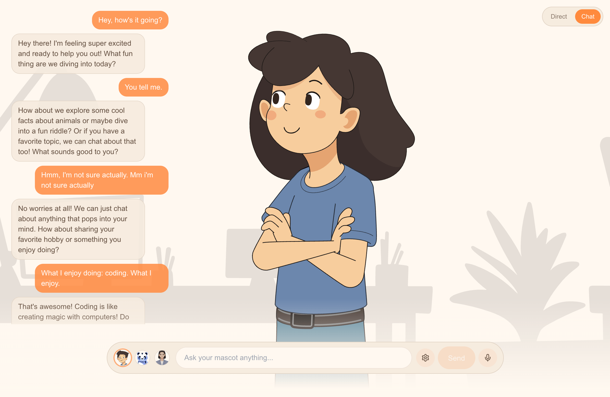

# Mascot Speech Demo

> AI chat with animated avatars, push-to-talk, and real-time lip-sync.



## What This Demonstrates

- **AI Chat mode** — conversational chat powered by OpenAI, with sentence-by-sentence streaming to the speech queue
- **Push-to-talk STT** — ElevenLabs real-time speech-to-text via WebSocket with instant recording start (token prefetching)
- **`useMascotSpeech` hook** — queue-based text-to-speech with synchronized lip-sync animations
- **Natural lip sync** — enhanced viseme processing for more realistic mouth movements
- **3 mascot avatars** — switch between NotionGuy, Panda, and Realistic Female
- **Multi-TTS engine support** — MascotBot (default), ElevenLabs, and Cartesia
- **Connection pooling** — undici Pool with warm TCP connections for low-latency API calls
- **Responsive design** — mobile-adaptive layout with `Fit.Cover` on mobile

## Prerequisites

- Node.js 18+
- pnpm (or npm/yarn)
- [Mascot Bot SDK subscription](https://app.mascot.bot) (for `.tgz` package and `.riv` files)
- [OpenAI](https://platform.openai.com) API key (for chat mode)
- [ElevenLabs](https://elevenlabs.io) API key (for push-to-talk STT)

## Quick Start

1. Clone this repository
2. Add the required private files (see below)
3. Configure environment variables
4. Install and run

```bash
pnpm install
pnpm dev
```

Open [http://localhost:3000](http://localhost:3000) to see the demo.

## Private Files You Need

### Mascot Bot SDK

- **File:** `mascotbot-sdk-react-X.X.X.tgz`
- **Where:** project root
- **How to get:** download from your [Mascot Bot dashboard](https://app.mascot.bot) after subscribing

```bash
cp /path/to/mascotbot-sdk-react-X.X.X.tgz ./
pnpm install
```

### Rive Animation Files

- **Files:** `notionguy.riv`, `panda.riv`, `girl.riv`
- **Where:** `public/`
- **How to get:** provided with your Mascot Bot SDK subscription

```bash
cp /path/to/notionguy.riv ./public/
cp /path/to/panda.riv ./public/
cp /path/to/girl.riv ./public/
```

You can use any subset of these mascots. If you only have one `.riv` file, update the `avatars` array in `src/app/page.tsx`.

## Environment Variables

Copy `.env.example` to `.env.local` and fill in your credentials:

```bash
cp .env.example .env.local
```

| Variable | Description | Required |
|----------|-------------|----------|
| `MASCOT_BOT_API_KEY` | Mascot Bot API key (from [app.mascot.bot](https://app.mascot.bot)) | Yes |
| `OPENAI_API_KEY` | OpenAI API key for AI chat and speech-to-text fallback | Yes |
| `ELEVENLABS_API_KEY` | ElevenLabs API key for real-time push-to-talk STT | Yes |

### Optional: ElevenLabs / Cartesia TTS

To use third-party TTS engines, click the gear icon in the demo and enter your API keys. They're stored in your browser's localStorage — never sent to our servers.

## Architecture

```
  Browser (Client)                              Server (Next.js API Routes)
  ─────────────────                             ──────────────────────────

  Chat Mode:
  ┌─────────────────┐                         ┌────────────────────┐
  │ useChat (AI)    ├── POST /api/chat ──────►│ OpenAI streaming   │
  │                 │◄───────────────────────-│ (sentence chunks)  │
  │ Sentence        │                         └────────────────────┘
  │ Streamer        │
  └────────┬────────┘
           │ speak(sentence)
           ▼
  ┌─────────────────┐                         ┌────────────────────┐
  │ useMascotSpeech ├── POST /api/visemes ───►│ Connection Pool    │
  │ (queue)         │◄── SSE (audio+visemes) ─│ → api.mascot.bot   │
  │                 │                         └────────────────────┘
  └────────┬────────┘
           ▼
  MascotRive (lip-sync)

  Push-to-Talk:
  ┌─────────────────┐                         ┌────────────────────┐
  │ usePushToTalk   ├── POST /api/stt-token ─►│ ElevenLabs token   │
  │                 │◄───────────────────────-│ (single-use)       │
  │ AudioContext    │                         └────────────────────┘
  │ 16kHz PCM       │
  │        │        │                         ┌────────────────────┐
  │        └────────┼── WebSocket (PCM→text) ►│ ElevenLabs         │
  │                 │◄───────────────────────-│ Scribe v2 Realtime │
  └────────┬────────┘                         └────────────────────┘
           │ append(transcribed text)
           ▼
         useChat → normal chat flow
```

```
File Structure:
├── page.tsx — Main component with avatar + controls
│   ├── ChatInterface — AI chat with sentence streaming
│   │   ├── useChat() — Vercel AI SDK for OpenAI streaming
│   │   ├── useSentenceStreamer() — splits stream into sentences
│   │   └── usePushToTalk() — ElevenLabs WebSocket STT
│   ├── useMascotSpeech() — SDK hook for speech queue + lip sync
│   └── MascotRive — Rive animation renderer
│
├── /api/chat — OpenAI streaming chat endpoint
├── /api/visemes-audio — Proxy to api.mascot.bot (connection pool)
└── /api/stt-token — ElevenLabs single-use token endpoint
```

The Mascot Bot proxy endpoint streams audio and viseme data via SSE. The connection pool maintains warm TCP connections for low-latency responses.

## Customization

### Lip Sync Settings

Adjust in `src/app/page.tsx`:

```typescript
const speech = useMascotSpeech({
  enableNaturalLipSync: true,
  naturalLipSyncConfig: {
    minVisemeInterval: 20,        // ms between visemes
    mergeWindow: 40,              // merge similar shapes within window
    keyVisemePreference: 0.6,     // preference for distinctive shapes (0-1)
    preserveSilence: true,        // keep silence visemes
    similarityThreshold: 0.4,     // merge threshold (0-1)
    preserveCriticalVisemes: true, // never skip important shapes
  },
});
```

### Using Your Own Avatar

Update the avatar config in `src/app/page.tsx`:

```typescript
const avatars = [
  {
    key: "notionguy",
    label: "Notion Guy",
    rivFile: "/notionguy.riv",
    artboard: "Character",
  },
  // Add more mascots here
];
```

## Links

- [Mascot Bot Documentation](https://docs.mascot.bot)
- [Support](mailto:support@mascot.bot) | [Discord](https://discord.gg/SBxfyPXD)

## License

MIT License. See [LICENSE](./LICENSE).
